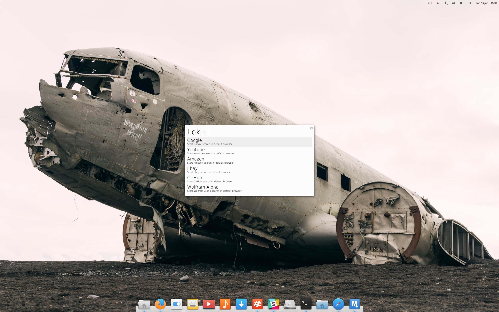
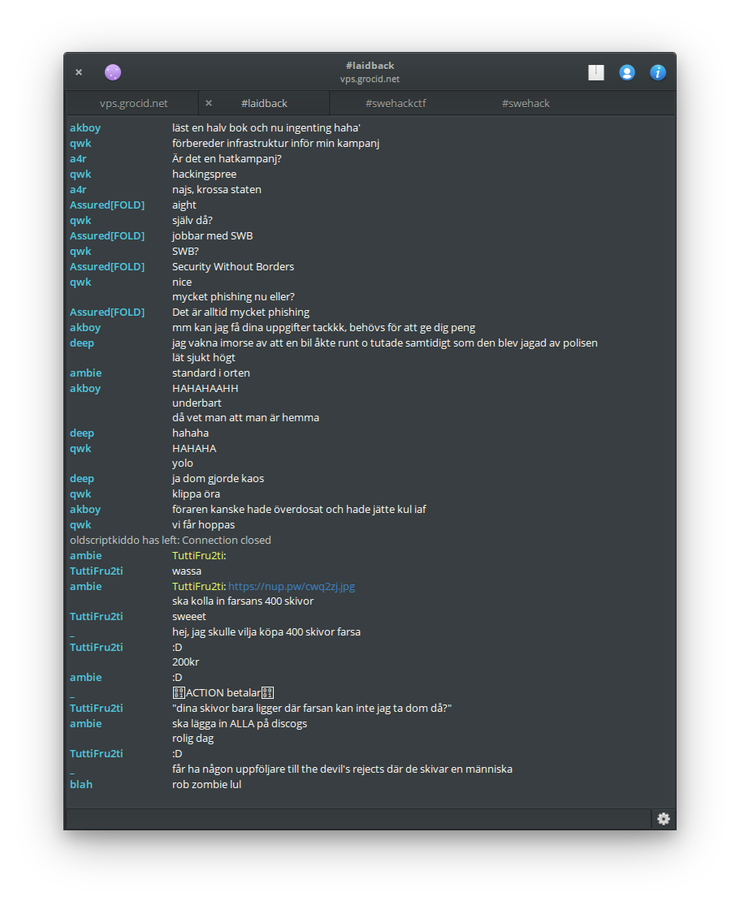

# Elementary OS Loki



## Keyboard mapping
I come from the world of macOS and is used to a swap between `CTRL` and `SUPER`.

Do `nano /usr/share/X11/xkb/symbols/pc`

and add

```
key <LCTL> {    [ Super_L       ]   };
key <LWIN> {    [ Control_L     ]   };
key <RCTL> {    [ Super_R       ]   };
key <RWIN> {    [ Control_R     ]   };
```

Run

`rm -rf /var/lib/xkb/*`

[Source](http://askubuntu.com/questions/131900/how-do-i-switch-the-command-key-and-control-key-on-a-macbook-pro)

## IRC Client

This is my slightly modified [Relay](https://github.com/grocid/relay2):



## Wingpanel

I am not very found of the default launcher Slingshot and have decided to replace with with Albert, which is faster and more useful and not as screen estate consuming. Since I don't use it, I found it quite annoying to have the text Applications in the upper left corner.

So, I decided to remove it. Also, I put the time and date indicator on the right side, because that is how I am used to have it (bad habit, maybe).


## Wallpapers


##Applications

[Albert](https://github.com/albertlauncher/albert) is an application launcher, which resembles Spotlight in macOS. It is pretty fast and customizable.

[Harmony](http://getharmony.xyz/) is a great replacement app for the stock music player. I listen to Soundcloud a lot and this allows me to control everything with my media keys.

[Sublime Text](https://www.sublimetext.com/) is a perfect replacement for TextMate (also a great app on macOS). It seems much more lightweight than e.g. Atom. I code a lot of Python from time to time and Sublime Text has builtin console, so I can run the code without leaving the editor.

[Sage](http://www.sagemath.org/) is a mathematical framework that integrates well with Python. Very useful for doing those crypto challenges on CTFs.

[Z3](https://github.com/Z3Prover/z3) is a solver and theorem prover, highly useful when dealing with complex expressions. Can be used in many ways in reverse engineering, but also for finding satisfying solutions to those involved crypto challenges.

[Baobab](https://wiki.gnome.org/Apps/Baobab) (Gnome Disk Usage Analyzer) is a pretty visualization tool for disk usage. 

